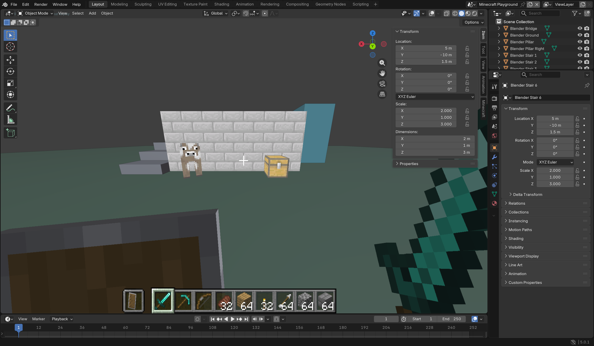
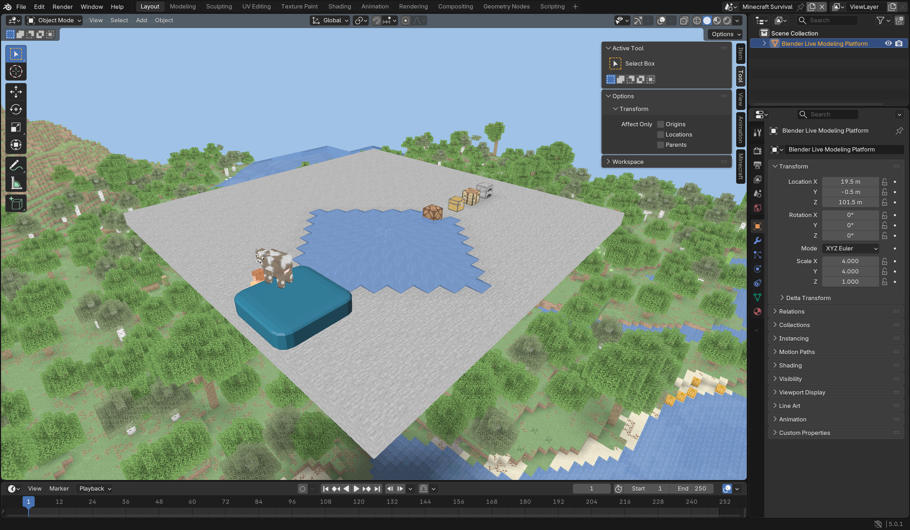
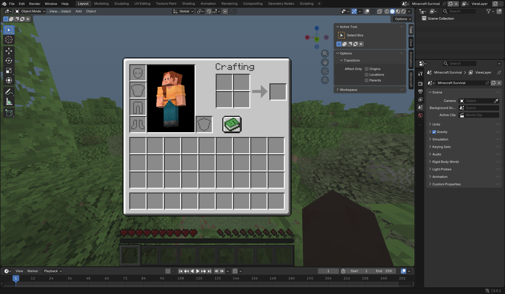

# MCInBlender

Play Minecraft **inside Blender**, using a Blender host for the SkyCraft protocol.
Blender owns the window, camera, input, scene rendering and host geometry. A hidden
Minecraft Java process supplies Minecraft's simulation, inventories, crafting,
entities and UI. Minecraft meshes are drawn inside Blender's 3D viewport, alongside
the user's scene. This is not a Minecraft host displaying Blender screenshots.

**Status: playable developer prototype.** Native Blender ground collision,
Minecraft block interaction, crafting, containers, smelting, redstone, water flow,
survival terrain, four camera choices and live Blender model collision have been
tested in a real Blender + Minecraft session. See [verified features and gaps](docs/STATUS.md).



Windows x64, Blender 5.0+, Minecraft Java 26.3, JDK 25. Minecraft requires a
separately owned copy. No Minecraft binaries, assets, account data or saves are
included in this repository.

The `minecraft/` module is derived from [chasmlol/SkyCraft](https://github.com/chasmlol/SkyCraft),
pinned at `bfcaf178524b92c2cdeb88e4ce0f13ef9ded6f32` (protocol 11).
See `THIRD-PARTY-NOTICES.md` and `licenses/SkyCraft-MIT.txt`.

## 在 Blender 里启动

目前支持 Windows x64、Blender 5.0+、JDK 25，以及 Python 3.10+。
首次构建还需要 GCC 或 Visual Studio 的 C++ Build Tools，用于编译共享内存原子操作的小型 DLL。
Minecraft/Fabric 开发依赖由 Gradle 下载，首次启动需要等待。

1. 克隆仓库，进入目录。
2. 如果无法自动找到 Blender 或 JDK，把 `config.example.json` 复制到
   `.local/config.json`，修改为实际安装路径。也支持 `PATH` 中的 Blender 和 `JAVA_HOME`。
3. 执行以下命令之一：

```powershell
# 在原生 Blender 地面、桥梁、台阶上玩 Minecraft
python scripts/launch.py --world scene

# 在 Blender 中玩正常生成的 Minecraft 生存世界
python scripts/launch.py --world normal

# 使用自己的 Blender 场景作为游戏场景，保留模型、材质和修改器
python scripts/launch.py --world normal --blend "C:/Projects/My Scene.blend"
```

启动后在 3D 视图右侧边栏选择 **Minecraft → Capture Input / Play**。
WASD 移动，鼠标看向/挖掘/放置，空格跳跃，E 背包，数字键和滚轮选择快捷栏，
F5 切换视角，Esc 打开游戏菜单。**Shift+Esc 释放输入并恢复 Blender 自由视角和编辑工具**。
菜单内的鼠标和文本输入同样由 Blender 转发。

侧栏 **View** 提供第一人称、后方第三人称、前方第三人称、**Blender View**。
选择 Blender View 后可自由旋转、平移、缩放视图；再次 Capture Input 会从这个
固定视角操控 Minecraft 玩家。其他视角会随玩家移动。

`scene` 模式创建一个新的 Blender 场景，不覆盖现有场景；玩家碰撞使用 Blender
求值后的网格三角形。普通封闭网格提供生物与流体所需的 1/8 方块体积碰撞，
开放网格提供薄壳；带 `mc_collider="BOX"` 的对象使用较快的轴对齐包围盒。
默认 **Live Blender collision** 自动更新模型、修改器和变换产生的碰撞；
也可关闭它，手动点击 **Update Blender Collision**。碰撞更新最多每秒四次，
复杂模型仍需性能优化。

融合方向是 **Blender 模型 → 游戏场景**：模型继续是原生 Blender 对象，可编辑、
设置材质和修改器；Minecraft 保留方块、背包、生物和世界状态。设置对象自定义属性
`mc_collision=false` 可将它作为不参与游戏碰撞的装饰。无需把 Minecraft 方块转成
Blender 可编辑网格。模型场景保存在 `.blend`，游戏进度保存在 Minecraft 存档。



`normal` 模式使用原版地形、自然出生位置、生存规则与维度。两个模式使用独立存档，
都保存在被 Git 忽略的 `minecraft/run/saves/` 下。初始开发存档允许命令，便于测试。
原版 Esc 菜单可保存并退出到标题画面。

当前启动器使用 Fabric 的 `runClient` 开发实例。它不读取个人启动器的账户或存档，
也不是已完成的正版启动器/多人联机发行包。正式认证启动、安装包和更多玩法验证仍在进行。



## Architecture

| Component | Responsibility |
| --- | --- |
| Blender add-on | Window, modal input, camera, GPU geometry and texture rendering, native scene collision |
| SkyCraft-derived Fabric bridge | Vanilla gameplay, saves, mobs, block states, animation meshes, transparent hand/HUD/UI |
| Windows shared memory | SkyCraft v11 rings, seqlocks and atomic triple buffering |

Minecraft world geometry is rendered by Blender; only hand/HUD/menu pixels are
composited as a transparent overlay. Minecraft's simulation runs in a hidden Java
process. Live Minecraft meshes remain GPU batches. Blender models remain native
Blender objects; the project does not convert Minecraft's world into editable
Blender data blocks.

## Development and verification

```powershell
python scripts/launch.py --only build
python -m pip install numpy
python -m unittest discover -s tests -v

# Real gameplay test in a running scene-mode developer session
python scripts/verify_runtime.py

# Real Blender modal-input and dimension tests in a normal-mode session
python scripts/launch.py --world normal --test-input
python scripts/verify_survival.py

# Crafting, containers, smelting, redstone and water through real Blender input
python scripts/verify_gameplay.py

# Restart only the Blender host to test live modeling and four camera choices
python scripts/launch.py --only blender --world normal --verification fusion --test-input
```

Run one developer session at a time. The live tests change the isolated development
world. Python tests require NumPy; Blender already supplies it for the add-on.
Gradle compilation/test output is in `logs/build.log`; game output is in
`logs/minecraft-build.log`. Blender status and errors are in `logs/host-status.json`.
Live test JSON and screenshots go into ignored `artifacts/`.

The Blender add-on lives in `blender_minecraft/`. Local runtime installations,
test saves, downloaded assets and diagnostic captures are ignored by Git.
See [protocol notes](docs/PROTOCOL.md) and the [implementation ledger](docs/STATUS.md).

