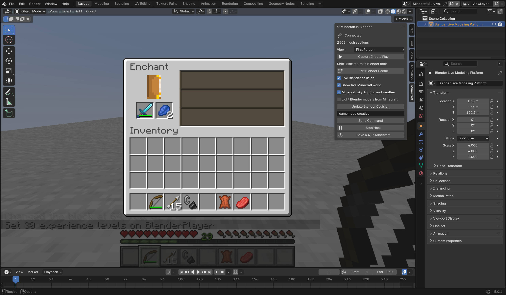

# Implementation and verification ledger

## Objective

Build and publish a public GitHub project in this directory that lets the user
play Minecraft in Blender using SkyCraft. Blender must be the actual host. Aim
for the complete Minecraft experience; do not declare completion after a mock,
a streamed full-screen Minecraft image, or a limited block placement demo.

User clarification: preserve both applications' capabilities, with Blender models
entering the Minecraft gameplay scene. Editing Minecraft blocks as Blender meshes
is explicitly not required. Provide first person, third person and Blender views.

Delivery scope, 2026-10-09: the user requested wrapping up at the working prototype
and stopping exhaustive checks of ordinary vanilla systems. The Blender host,
native model collision/editing, four camera choices and representative gameplay
have been exercised in real sessions. Remaining limitations below are disclosed
future work; they are not claims that every Minecraft feature has been verified.

## Architecture

- Blender window and modal operator receive all keyboard, pointer, text and UI input.
- Blender renders SkyCraft section geometry, animated entity batches and textures
  in its own viewport. Native Blender scene geometry participates in depth testing.
- Minecraft provides gameplay/simulation, emits render protocol messages and the
  transparent hand/HUD/screen overlay. It remains a separate hidden process.
- Host scene collision travels back to MC; actor, host-water and damage integration
  remain incomplete as tracked below.
- Save/load, death/respawn, survival/creative, inventory/crafting, block entities,
  redstone, fluids, mobs, combat, dimensions and multiplayer need real verification.

## Stage 1 — playable host, 2026-10-09

Implemented:

- SkyCraft v11 named shared-memory ownership, bounded rings, seqlock snapshots,
  atomic overlay triple buffering, MC/Blender coordinate conversion.
- Native section, entity, avatar, dropped-item, projectile and crack meshes;
  animated textures; transparent materials and target outline.
- Blender camera and F5 modes; modal keyboard, mouse, wheel and text forwarding;
  focus-loss release and Shift+Esc escape from capture.
- Static Blender triangle collision for players; box voxel occupancy for
  mobs/fluids; manual collision refresh after scene edits.
- Scene playground and normal vanilla survival mode, with separate local saves.
- Vanilla spawn, dimension transitions, pause, water-flow and sneak-edge behavior
  preserved in normal mode. Scene-mode host-specific rules stay separate.
- Transparent HUD/hand/screens, title/loading menus, environment diagnostics and
  graceful Minecraft shutdown input.
- Automatic internet sharing and Discord presence disabled for this host.

## Verification

Environment: Windows x64, Blender 5.0.1, Minecraft Java 26.3, JDK 25,
NVIDIA OpenGL. Tests use isolated development saves under `minecraft/run/`.

| Evidence | Result |
| --- | --- |
| Python wire protocol, startup handshake, buffer ownership/backpressure, geometry, culling and atlas tests | 19 passed |
| Fabric bridge build and inherited Java collision tests | Successful; 21 tests |
| Native Blender floor walking | Player moved 1.72 blocks without falling through the floor |
| Place/break block on Blender ground | Real section updates and visible edits, both passed |
| Inventory through shared-memory input | Open/close passed |
| Actual Blender modal E key | Opened vanilla InventoryScreen |
| Actual Blender modal F5 key | Cycled camera modes 1 → 2 → 0 |
| Actual Blender modal Esc key | PauseScreen; gameTime stopped while paused |
| Actual Blender modal Shift+Esc | Released capture without errors |
| Overworld → Nether → End → Overworld | Each replaced geometry and retained correct destination |
| Native scene coexistence | Blender floor/pillars/stairs, MC wall/chest/cow and HUD visually inspected |
| Save and shutdown | Server logged saving players and all three dimensions before clean exit |
| Death and respawn through Blender Tab/Enter | DeathScreen at health 0, natural surface spawn at health 20 |
| Restart Blender while MC keeps running | Position stayed exactly `(-29.5,90,-6.5)`; geometry resent without errors |

Live tests: `scripts/verify_runtime.py` and `scripts/verify_survival.py`.
The restart regression is `scripts/verify_reconnect.py` (normal mode).
Machine-generated local records: `artifacts/runtime-tests.json` and
`artifacts/survival-tests.json`. Only selected screenshots are committed.
Stage 1 dimension tests use commands; Stage 6 adds physical Nether portal traversal. Block placement tests
check mesh changes and visible behavior, not every block type. Protocol tests
exercise real Windows shared memory under separate test mapping names.

A restart regression initially exposed an unintended teleport to the default
Blender origin. The fix publishes state before heartbeat and reserves sequence
zero for adopting a vanilla player's position; the live restart regression passed.

## Stage 2 — Blender models and gameplay coexist

- Release input to restore Blender orbit/pan/zoom, overlays and modeling tools.
  Returning to play preserves the editor view for the next editing session.
- View selector: first person, behind-player third person, front-facing third
  person and Blender camera. In Blender camera mode the player remains controllable
  from a fixed viewport angle.
- Evaluated model geometry and modifiers update game collision automatically,
  throttled to four updates/second. Updates replace regions without clearing the
  entire collision world, so unchanged ground remains available.
- Generic closed mesh volume and open mesh shells feed 1/8-block occupancy to
  mobs and fluids. Player contact still uses exact triangles. Large/complex
  meshes and continuously moving platforms need further optimization/physics work.
- `--blend` loads the user's existing scene, keeping its native Blender data.
  Game saves and `.blend` scene saves remain separate.
- Read-only inventory, container-slot and targeted-block state aids diagnostics.
  Real gameplay still uses ordinary keyboard/mouse handling.

Real session checks (all passed):

| Check | Evidence |
| --- | --- |
| 2x2 crafting | One log → four planks → one crafting table, using real slot clicks |
| Place and use crafted workbench | Placed table, opened 3x3 grid, crafted four sticks |
| Chest | Deposited five apples, closed/reopened, withdrew the same five |
| Furnace | Inserted raw iron and coal, waited for smelting, collected iron ingot |
| Redstone | Mouse-clicked lever, server verified lamp off → on → off |
| Water | Used bucket; server verified source and adjacent flow, mesh updates observed |
| Live Blender model creation/movement | Player stood at model top y=102; moving model let player fall to MC floor y=100 |
| Evaluated modifier collision | Player stood on a beveled Blender mesh using its evaluated triangles |
| Generic model volume | Live cow settled at y=102.125 on a model with top y=102 (subvoxel shell tolerance) |
| Four view choices | Actual MC modes 1/2/0; player moved 3.79 blocks while Blender camera stayed fixed |
| Scene persistence | Saved/reopened native `.blend`, reconnected game and retained Blender view |

Test drivers: `scripts/verify_gameplay.py` and `scripts/verify_fusion_in_blender.py`.
Local results: `artifacts/gameplay-tests.json`, `artifacts/fusion/tests.json`.
The fusion tests save an ordinary Blender model scene in `artifacts/fusion/`.
They do not bake or edit Minecraft geometry.

## Stage 3 — Viewport rendering performance

- Reject off-screen section bounds using the actual Blender perspective or
  orthographic view. Geometry crossing the near plane or screen edge remains.
- Sort transparent sections from the Blender camera, including free editor views.
- Pack animated atlas tiles into one texture upload and GPU draw per batch.
- Defer hidden HUD uploads while editing; the newest overlay resumes on capture.
- Evict meshes and companion records when Minecraft unloads a client chunk;
  successful delivery is required before forgetting an eviction.
- Diagnostics include draw timing, frame rate, draw calls and retained sections.

The same saved scene and free Blender perspective view held 2,573 mesh sections.
The HUD was hidden in this editing view. Before these
changes, the local session averaged 17.79 FPS with 2,988 draw calls. After the
changes it averaged 58.56 FPS with 868 draw calls and 735 visible sections.
The optimized renderer with culling disabled averaged 24.16 FPS. These are
short local samples, not a general hardware benchmark. The player and camera
were stationary; mobs and the Minecraft simulation remained active.

`scripts/verify_performance_in_blender.py` checks GPU results, then collects A/B
timing in the same running scene. Perspective and orthographic culling produced
exactly the same rendered RGBA pixels as drawing all sections. A separate GPU
readback verified all animated tile pixels and untouched atlas pixels. All five
checks/samples completed without errors. Local results: `artifacts/performance/`.

`scripts/verify_streaming.py` moved the player to x=1040, x=-1040 and back to the
original arena. Old mesh extents disappeared at each destination and return
loading rebuilt the original 2,573 sections. HUD upload resumed after free editing,
and real Blender input opened/closed Minecraft's inventory. All four checks passed
with no host errors; this is a travel regression, not a long-duration memory test.

## Stage 4 — Minecraft atmosphere and session shutdown

- Minecraft's final 16×16 lightmap is copied asynchronously to Blender. Block and
  sky light remain separate, including night vision, darkness, brightness settings
  and dimension-specific light colors. World meshes retain vanilla face shading.
- Sky/fog colors, celestial angles, moon phase textures and rain/snow columns come
  from Minecraft. Blender draws the sky and precipitation into its own viewport.
  Environment textures are read from the installed game/resources at runtime.
- The atmosphere checkbox restores an unobstructed Blender editing view when
  desired. It does not change native Blender materials, lights or world data.
- **Save & Quit Minecraft** invokes Minecraft's normal save/exit path and leaves
  Blender open. Closing Blender also saves/exits Minecraft after a short grace
  period. `--keep-minecraft` retains the development reconnect workflow.
- Command text waits for a confirmed ChatScreen before typing, including startup
  loading transitions.

All ten real-session checks completed: day, night, night vision, rain, snow,
Nether, End, return to Overworld, sun and moon presentation. At
midnight, sky-lit palette RGB changed from `(255,255,255)` to `(71,71,129)` while
maximum block light stayed `(255,255,255)`. Night vision raised dark/sky light
again. Day, night, rain, snow, sun, moon and End captures were visually inspected. Native Blender
objects retained their own lighting, as intended for editable scene objects.

Shutdown checks verified server save logs and process exit, as well as preserved
native object transforms, vertex count, material and modifier names after the
Save & Quit operator. A fresh process restored the same inventory and position;
a real server block query also confirmed the saved gold-block marker persisted.
GPU culling comparisons were repeated with atmosphere shading enabled: both
perspective and orthographic views still produced identical pixels.
With atmosphere enabled the local free-view sample averaged 50.22 FPS; this is
another short local sample, not a cross-machine performance guarantee.
Drivers: `scripts/verify_environment.py` and
`scripts/verify_lifecycle_in_blender.py`; local results are in
`artifacts/environment-tests.json` and `artifacts/lifecycle/`.

## Stage 5 — Minecraft lights on native Blender models

- Optional native lighting uses Material Preview and a temporary collection of
  Blender sun/point lights. Daylight/moonlight follow the actual game palette and
  celestial angles; nearby block emitters update when blocks change or unload.
- Default cap: 32 emitting blocks reaching the bounds of up to 64 visible native
  models nearest the viewport camera. Strengths and cap are adjustable. Updates
  run at most four times/second and unchanged light properties are not rewritten.
- Native materials, modifiers, World and existing user lights remain in place.
  Helpers are removed on disable/Stop/disconnect and before saving `.blend`; the
  next runtime tick recreates them. Deleting the helper collection recovers safely.
- Eevee requires its overlay/depth path to remain active to composite native
  materials with Minecraft geometry. Editing aids are hidden individually during
  play; HUD and status text use explicit pixel-space transforms.
- Resetting a host session now re-acknowledges Minecraft's PID and advances the
  export generation, even when Blender's process id stays the same. Stop/Start
  therefore replays the complete atlas, geometry and environment assets.

This is an adjustable physical-light approximation. The colored block lights
come from SkyCraft's block appearance palette, not a vanilla colored-light system.
Blender objects cast shadows on one another. Minecraft geometry does not yet
cast those native shadows, so indoor sunlight and light through Minecraft walls
remain limitations. Native Blender objects still do not receive Minecraft fog.
Existing user lighting contributes to the result, including at night.

`scripts/verify_lighting_in_blender.py` measures final window pixels on a native
white sphere, with a fixed Blender camera. A local sample changed from about
RGB `(112,112,112)` at noon to `(17,22,47)` at midnight. Placing glowstone raised
the same pixels to `(167,158,144)`; a soul lantern produced `(81,118,134)`.
Removing the emitter returned the model to moonlight. The samples verify visible
change, not a photometric match with vanilla blocks.

All eleven integration checks passed. The driver also checks native/MC depth ordering, all follow-camera
choices in Material Preview, helper deletion recovery, scene save contents,
viewport restoration and Stop/reconnect cleanup. Local screenshots and reports:
`artifacts/lighting/`. Pure Python tests cover negative section coordinates,
emitter bounds/selection limits, corrupt records and day/night/dimension palettes.
The same-process reconnect restored the complete 2,573-section arena and texture
atlas after initially exposing a missing-resend bug. All 23 Python tests and the
Java build's 21 tests passed. Native light occlusion limitations above remain.

## Stage 6 — Combat, enchanting and physical portal travel

The new `scripts/verify_adventure.py` driver uses Blender's modal keyboard and
mouse events for attacks, item use, enchanting UI and walking through portals.
Commands prepare an isolated arena/inventory and read server evidence. They do
not perform the tested attacks, enchant the sword or change dimensions.

| Check | Real-session evidence |
| --- | --- |
| Sword melee | Cow health 10 → 3 after one click; a second click killed it |
| Bow | Actual draw/release consumed one arrow; golem health 100 → 92 |
| Hostile damage | An active zombie reduced the player's health from 20 to 14 |
| Enchanting | Shift-clicked sword/lapis into the table, clicked an offer; XP 30 → 29, lapis 3 → 2; server inventory confirmed Sharpness I |
| Nether portal | Right-clicked flint and steel, walked into the lit frame, arrived in the Nether at `(9,84,24.5)` |
| Return portal | Walked outside the generated portal, waited for its real cooldown, walked back in and returned to `(64,100,70.5)` in the Overworld |

Both physical dimension transitions cleared the previous world geometry and
loaded destination sections. The driver prepares a safe walkway at the generated
Nether portal before testing return travel. This is not an unmodified wilderness
survival run. All six driver records, including fixture preparation, passed with
no host errors. Reports and screenshots are under `artifacts/adventure-tests.json`
and `artifacts/captures/adventure-*`.

Read-only environment diagnostics now expose the targeted entity, held stack
enchantment/damage state, block at the player's feet and enchantment-menu offers.
They observe Minecraft; normal input still performs gameplay.

Repeated testing exposed an intermittent Windows sharing violation in the local
diagnostic inbox. The consumer now waits without reordering queued press/release
events and claims each file before dispatch. A locked cleanup cannot replay the
action. Five new tests cover read/claim/cleanup locks and malformed/failed actions.
All 28 Python tests pass; the Fabric build and its 21 Java tests pass.

## Known limitations and future work

- More vanilla systems need end-to-end tests, including riding, trading, brewing,
  fishing and physical End portal travel. Tested combat/enchanting systems still
  need broader weapon, enchantment, entity, recipe and block coverage.
- Clouds, exact vanilla star/End-sky presentation, some special entity effects
  and sound routing need more work. Audio currently comes from Minecraft.
- Native light occlusion by Minecraft blocks, Minecraft fog on native models and
  more accurate ambient lighting need further integration. Weather data follows the player;
  native Blender roofs and distant free-camera weather need further integration.
- Broader hardware benchmarks, GPU texture upload cost during play, and long-session
  memory profiling require more work.
- Fast animated Blender objects, riding moving platforms, Blender actor damage,
  destruction and host water integration are incomplete.
  Solid/dug protocol messages are currently retained only.
- Developer launcher only: authenticated production launch, multiplayer validation,
  distributable add-on/runtime packaging and install/update UX are unfinished.
- Texture-pack/mod compatibility and non-Windows platforms are unverified.

This is a delivered developer prototype, not a production launcher or a guarantee
of compatibility with every Minecraft feature, mod or hardware configuration.
